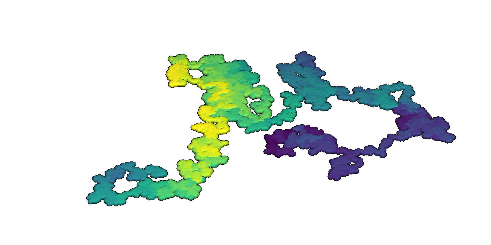

# Tutorials

This is a collection of
[tutorials](https://baharmon.github.io/tutorials/)
teaching creative computation for design and spatial science.
These open education resources are released under the
[Creative Commons Attribution 4.0 International License](https://creativecommons.org/licenses/by-sa/4.0/).

* [Computational design](https://baharmon.github.io/tutorials/design)
* [Geocomputation with GRASS](https://baharmon.github.io/tutorials/grass)

