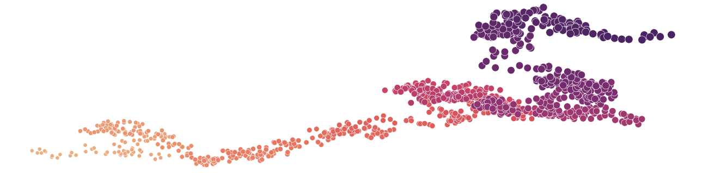
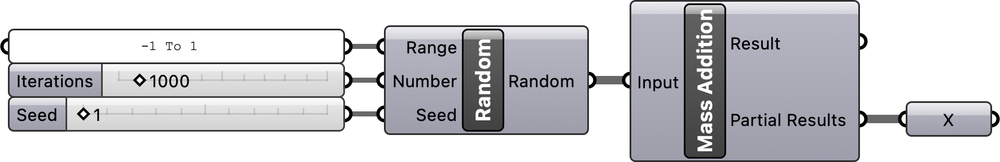
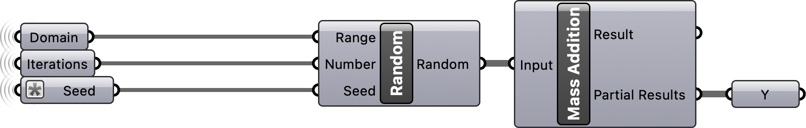
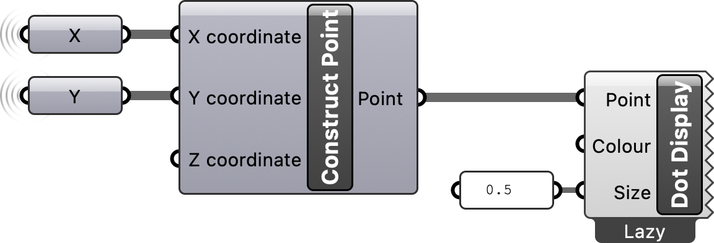
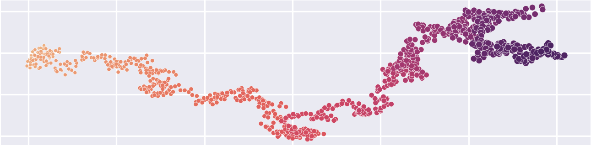

## Introduction

This tutorial is a guide to 
simulating random walks 
with Grasshopper - 
Rhino's visual programming environment 
[@Rhino].
A random walk is an algorithm
that simulates a walker taking steps in random directions.
To easily simulate a 2-dimensional random walk,
first generate sets of random vectors representing steps
and then take the cumulative sum of these vectors
to find the position of the walker at each step. 
For this 2-dimensional random walk,
we will decompose movement
into x- and y-vectors
representing east-west and north-south movement. 
For each step
our walker will choose to move
a pace to either east or west
and north or south.
To make the walk smoother,
we will incorporate an element of unpredictability
by allowing our walker to take partial steps.

## Define x-component of steps

First define the x-component
of our walker's movement.
We will represent a full pace to the west as -1
and a full pace to the east as 1.
Start by generating a list
of random floating point numbers
between -1 and 1. 
To do this, 
place a  component 
on the canvas.
Plug a  into the 
`Seed` input parameter
to set the seed of the pseudorandom number generator.
Plug a  into the 
`Number` input parameter
to set the number of random values to be generated.
Plug a text panel into the `Range` input parameter
and set the text to `-1 to 1`.
Then plug the output list of random numbers into a
 component.
This will calculate the cumulative sum
of the random numbers.

{fig-align="left" width=100%}

## Define y-component of steps

Next define the y-component
of our walker's movement.
Place a  component on the canvas
and use the same values for the input `Range` and `Number`,
but use a different value for the input `Seed`.
A simple way to do this is to reuse the same seed,
but add 1 to it.
Then use 
calculate the cumulative sum
of the resulting list of random numbers.

{fig-align="left" width=100%}

## Plot random walk

The  component
returns a result - the total cumulative sum -
and a list of partial results -
the cumulative sum at each step.
These partial results represent
the x- or y-components of our walker's
position in space at each step.
To plot our walkers position in space,
place a 
on the canvas
and plug the partial results of the cumulative sums
along the x- and y-vectors
into its input x- and y-coordinates.
Finally visualize the resulting points
using a  component.

{fig-align="left" width=65%}

