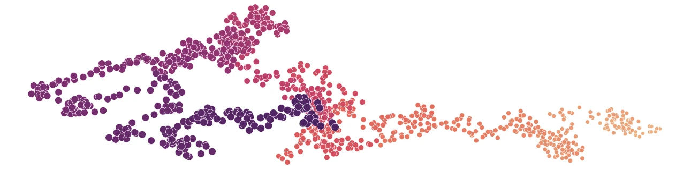
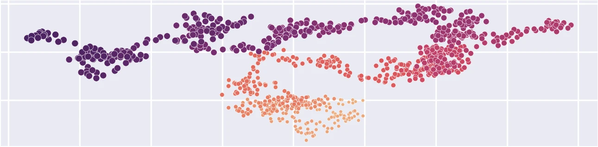
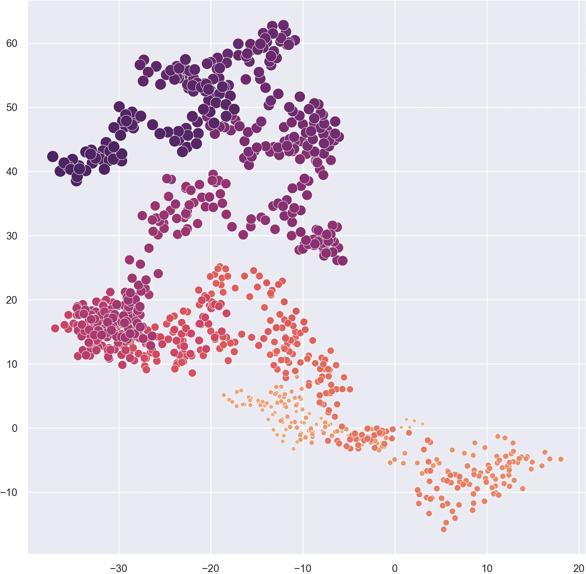
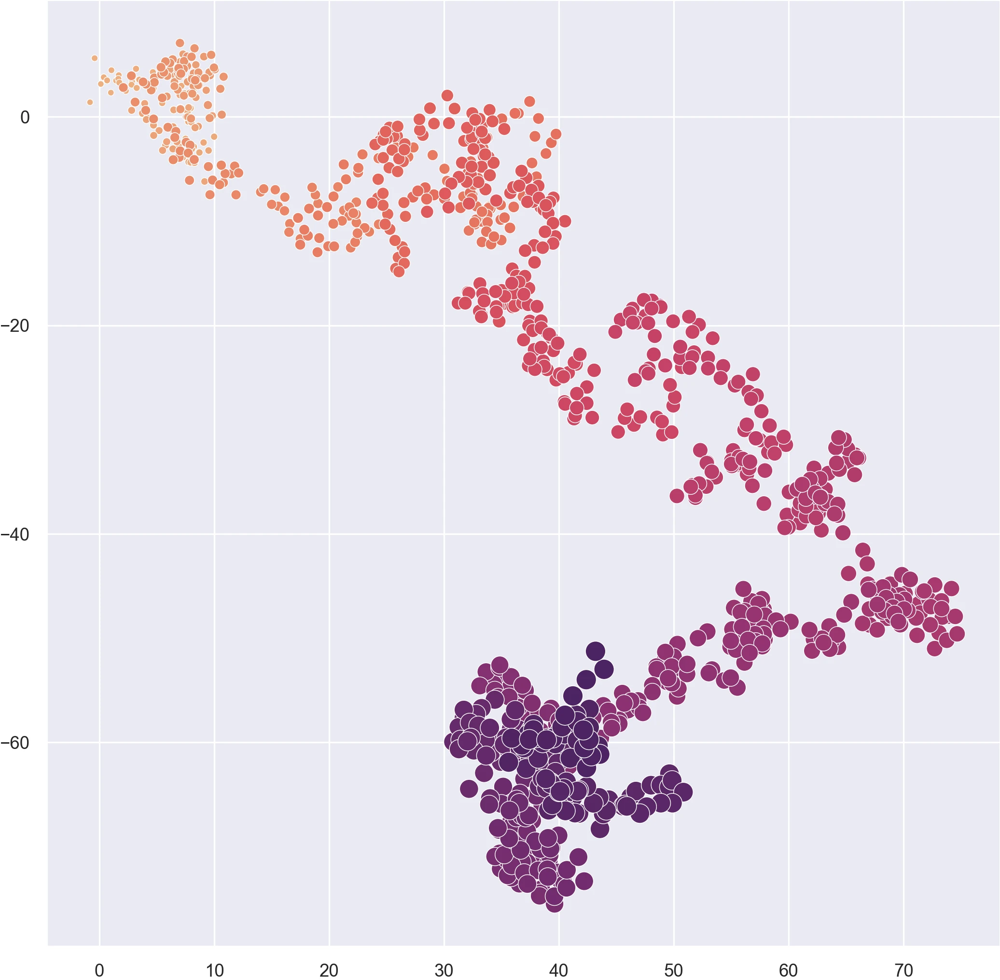
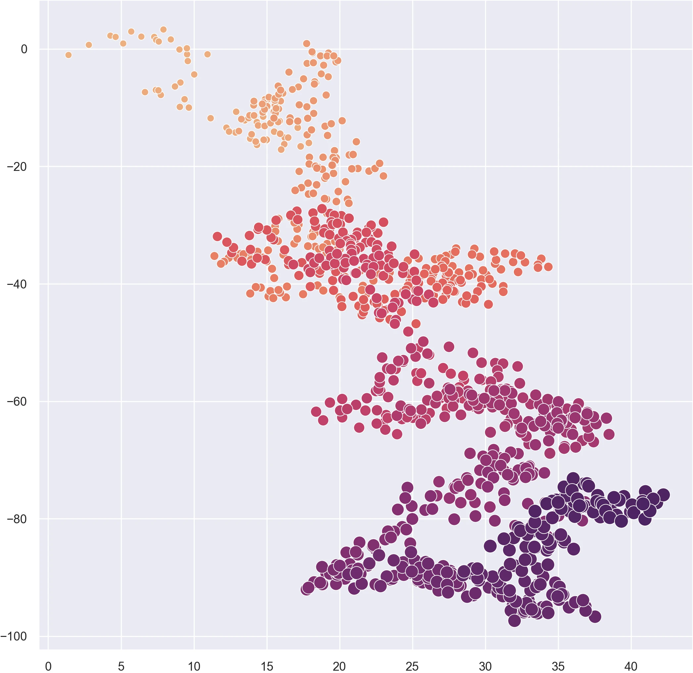
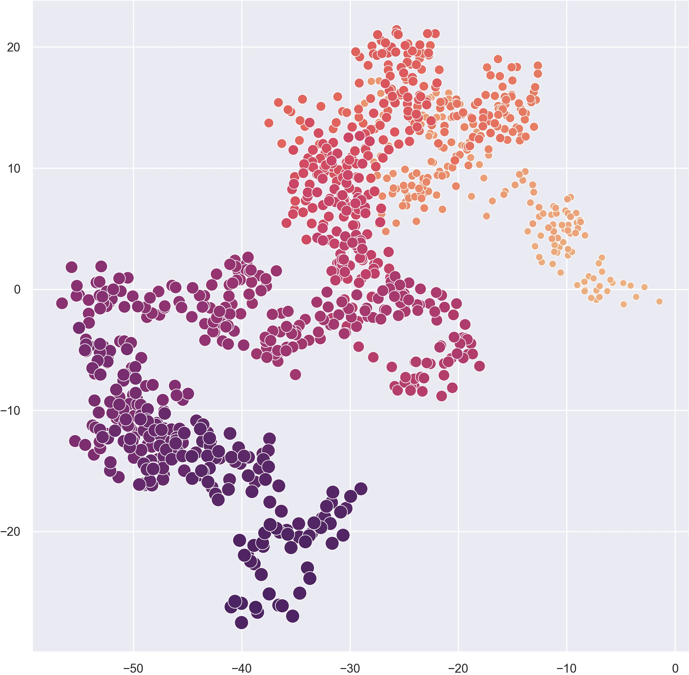

## Introduction

Learn how to generate a 2-dimensional random walk
using Python's [NumPy](https://numpy.org/) library.
A random walk is an algorithm 
that simulates random movement through space.
Each step the walker takes is in random direction.
Here we implement a random walk by 
generating sets of random direction vectors representing steps
and then calculating the cumulative sum of the vectors
to find the position of the walker at each step. 

## Import libraries

First import the required libraries
[NumPy](https://numpy.org/)
and [Seaborn](https://seaborn.pydata.org/).
Numpy is a library for programming multidimensional arrays
[@Harris:2020; @NumPy]
which we will use to generate the random steps in our walk.
Seaborn is a library for statistical data visualization
[@Waskom:2021; @Seaborn]
which we will use to plot our random walk.

```{python}
# Import libraries
import numpy as np
import seaborn as sns
```

## Set theme

Set a theme for plotting with Seaborn using
.
Try setting the style to `darkgrid`
and the context to `paper`.
See the Seaborn tutorial on 
[aesthetics](https://seaborn.pydata.org/tutorial/aesthetics.html)
for a guide to customizing plots. 

```{python}
# Set theme
sns.set_theme(
    context="paper", 
    style="darkgrid"
    )
```

## Random steps

Generate a set of random direction vectors along the x-axis
and another set of random direction vectors along the y-axis.
These vectors represent the x- and y-direction 
of each step that the walker will take.
First instantiate NumPy's random number generator
.
Then generate an array of x-vectors
drawn from a Gaussian (i.e. normal) distribution with
.
Set the location parameter 
representing the mean of the distribution to `0`.
Set the scale parameter 
representing the standard deviation 
or spread of the distribution to `0.25`.
Set the size parameter to the number of steps 
the walker will take. 
Now generate an array of y-vectors the same way.

```{python}
# Set variables
i = 1000 # Iterations
mu = 0.0 # Mean
sigma = 0.25 # Standard deviation

# Instantiate random number generator
rng = np.random.default_rng()

# Generate random steps
u = rng.normal(mu, sigma, i)
v = rng.normal(mu, sigma, i)
```

## Solve position
Find the position of each step the walker takes
by calculating the cumulative sum of the direction vectors
with .

```{python}
# Solve position
x = np.cumsum(u)
y = np.cumsum(v)
```

## Plot function

Use Seaborn to plot 
the x- and y-coordinates
as a scatter plot
with a size and color gradient
representing relative time.
Create a scatterplot with 
.
Set `x` and `y` to the arrays
of x- and y-coordinates.
Use 
to generate an array of time steps. 
Set the `size` and `hue` parameters
to this array of time steps.
Use the `palette` parameter to assign 
a perceptually uniform color gradient
such as `flare` or `viridis`. 

```{python}
# Plot function
plot = sns.scatterplot(
    x=x,
    y=y,
    size=np.arange(i),
    sizes=(25, 100),
    hue=np.arange(i),
    palette="flare",
    legend=False
    )
```



::: {#fig:random-walks layout-ncol=2}









Random walks
:::
