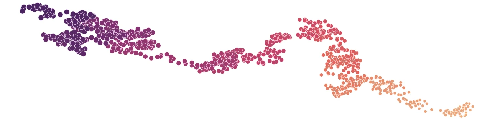
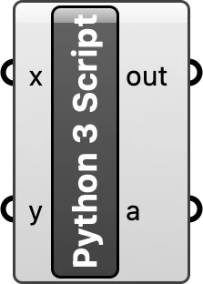
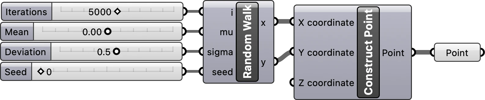
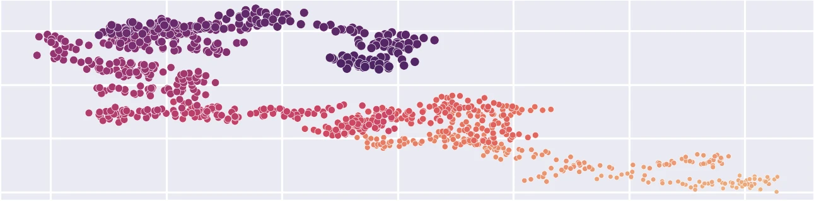

## Introduction

Learn how to use Python scripting in Grasshopper
to efficiently generate a random walk.
In this tutorial you will create a custom script component
for generating random walks in a visual programming environment.
The simple visual program we composed
in the tutorial [Random walk with Grasshopper](random-walk-01.qmd)
was quite slow, 
so we will write a faster, more efficient implementation in Python
using the [NumPy](https://numpy.org/) array programming library
[@Harris:2020; @NumPy].

## Script component

Place a Python 3 
[script component](https://developer.rhino3d.com/guides/scripting/scripting-gh-python/#python-component)
from the script panel in the math tab 
on Grasshopper's canvas. 
Double click on the center of the script component
to open the script editor and start writing your code.
To learn more read the
[Rhino Developer's Scripting Guides](https://developer.rhino3d.com/en/guides/scripting/).

{fig-align="left" width=10%}

## Python script

In the script editor write a Python program for simulating random walks. 
First import [NumPy](https://numpy.org/),
then instantiate its random number generator,
generate arrays of random x- and y-vectors representing the direction of each step,
calculate the position of each step as the cumulative sum of the vectors,
and convert the arrays into lists.
Save your program and close the script editor.
Right click on your script component
to rename it `Random Walk`. 

```python
"""Random Walk"""
# requirements: numpy

# Import library
import numpy as np

# Instantiate random number generator
if seed is not None:
    rng = np.random.default_rng(seed)
else:
    rng = np.random.default_rng()

# Generate random steps
u = rng.normal(mu, sigma, i)
v = rng.normal(mu, sigma, i)

# Solve position
x = np.cumsum(u).tolist()
y = np.cumsum(v).tolist()
```

## Programmed script component

Now that your script is ready,
compose a simple visual program using it.
First define the input and output parameters 
for the component.
Zoom in on the script component
and plus icons for inserting parameters will appear.
Use these to insert the input parameters
`i`, `mu`, `sigma`, and `seed`
and the output parameters
`x` and `y`. 
Add number sliders to your canvas
and plug these to the input parameters. 
Plug the output parameters `x` and `y` into a

component as the input x- and y-coordinates.

{fig-align="left" width=75%}

