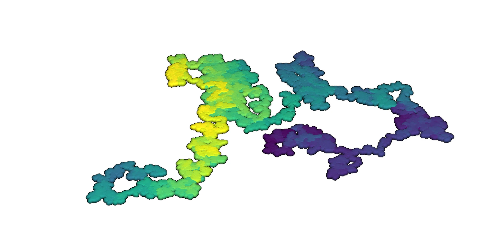
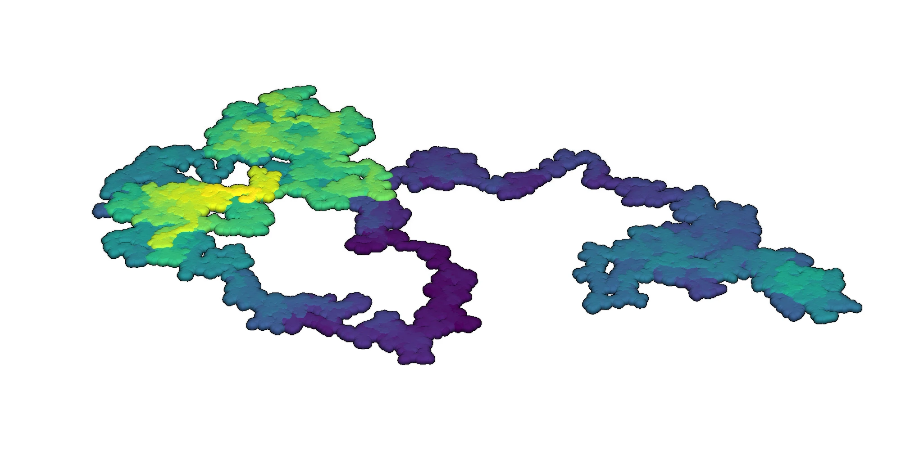
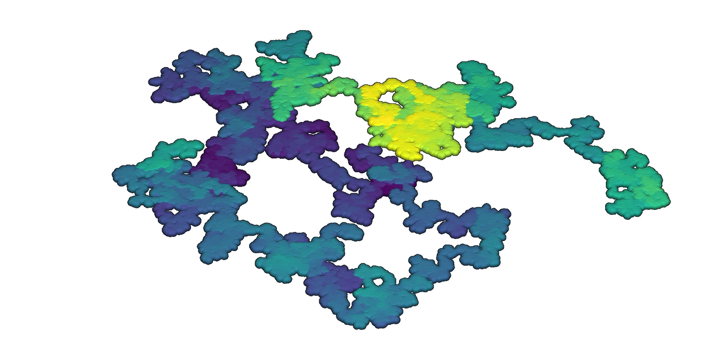
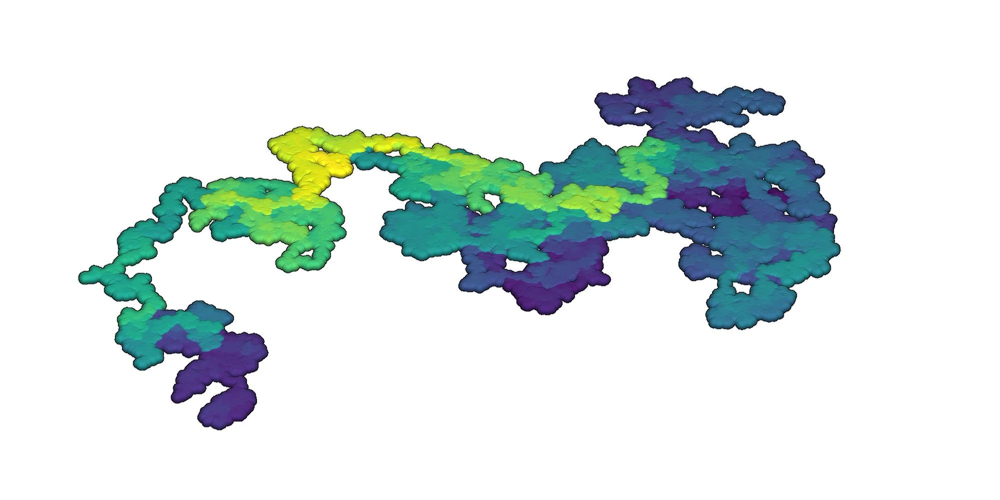

<!-- Add Jupyter notebook -->



## Introduction

Learn how to generate a 3-dimensional random walk
in Python with [NumPy](https://numpy.org/)
and render it with either
[PyVista](https://pyvista.org/)
or [Open3D](https://www.open3d.org/).

## Random walk with NumPy

Generate a 3-dimensional random walk with
Python's [NumPy](https://numpy.org/) library for array programming
[@Harris:2020; @NumPy].

```python
# Import libraries
import numpy as np

# Set variables
i = 1000000 # Iterations
mu = 0.0 # Mean
sigma = 0.25 # Standard deviation
scale = 2 # Scale factor

# Instantiate random number generator
rng = np.random.default_rng()

# Generate random steps
u = rng.normal(mu, sigma * scale, i)
v = rng.normal(mu, sigma * scale, i)
w = rng.normal(mu, sigma / scale, i)

# Solve position
x = np.cumsum(u)
y = np.cumsum(v)
z = np.cumsum(w)

# Stack coordinates
xyz = np.column_stack((x, y, z))
```

## Render with PyVista

Render an interactive 3D visualization
of the random walk with the Python library
[PyVista](https://pyvista.org/)
[@Sullivan:2019; @PyVista].

<!--
Render to an image file with:
```python
window_size=(2000, 2000),
off_screen=True,
screenshot='random-walk-3d.webp'
```
-->

```python
# Import libraries
import pyvista as pv

# Set plot theme
pv.set_plot_theme("document")

# Plot
pv.plot(
    xyz,
    scalars=z,
    render_points_as_spheres=True,
    point_size=20,
    show_scalar_bar=False,
    eye_dome_lighting=True,
    ambient=0.6,
    diffuse=0.8,
    window_size=(2000, 2000)
)
```

::: {#fig:random-walks-3d layout-ncol=2}








3D random walks rendered with PyVista
:::

## Render with Open3D

Render an interactive 3D visualization
of the random walk with the Python library
[Open3D](https://www.open3d.org/)
[@Zhou:2018; @Open3D].

```python
# Import libraries
import open3d as o3d
import matplotlib.cm as cm
import matplotlib.colors as colors

# Read point cloud
cloud = o3d.geometry.PointCloud()
cloud.points = o3d.utility.Vector3dVector(xyz)

# Assign color gradient
colormap = cm.get_cmap("viridis")
normalization = colors.Normalize(vmin=z.min(), vmax=z.max())
normalization = normalization(z)
gradient = colormap(normalization)
gradient = gradient[:, :3]
cloud.colors = o3d.utility.Vector3dVector(gradient)

# Render points
o3d.visualization.draw(
    [cloud],
    point_size=4,
    width=2000,
    height=2000,
    show_skybox=False,
    raw_mode=True
    )
```

<!-- Simple rendering
`python o3d.visualization.draw_geometries([cloud])`

```python
colormap = cm.get_cmap("viridis") # get a color map object
normalization = colors.Normalize(vmin=z.min(), vmax=z.max()) # create a normalization object
normalization = normalization(z) # normalize array
gradient = colormap(normalization) # apply color map
gradient = gradient[:, :3] # extract RGB from RGBA
cloud.colors = o3d.utility.Vector3dVector(gradient) # assign colors to point cloud
``` -->

<!-- Export to pcd and visualize with Open3D viewer -->