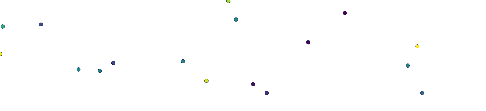
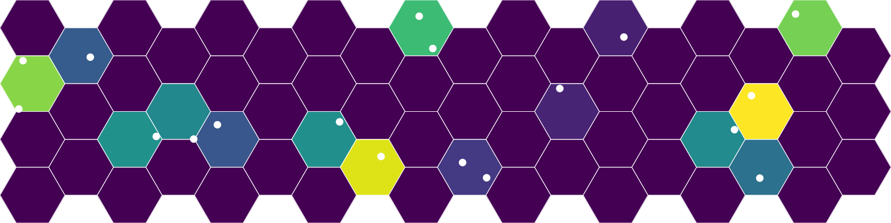
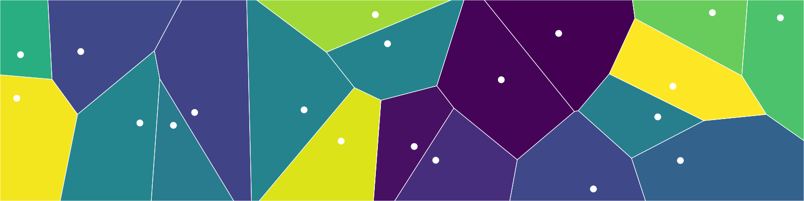
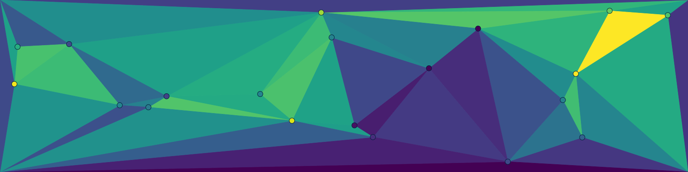
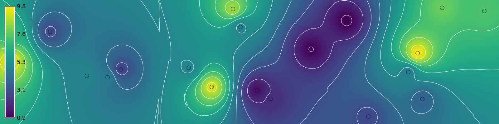
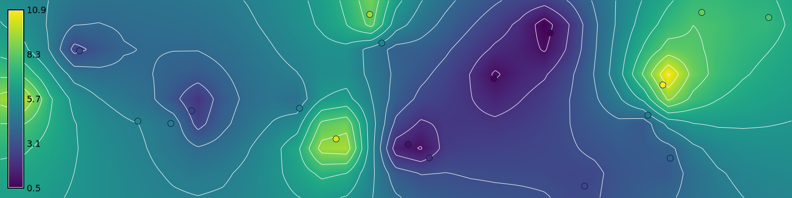
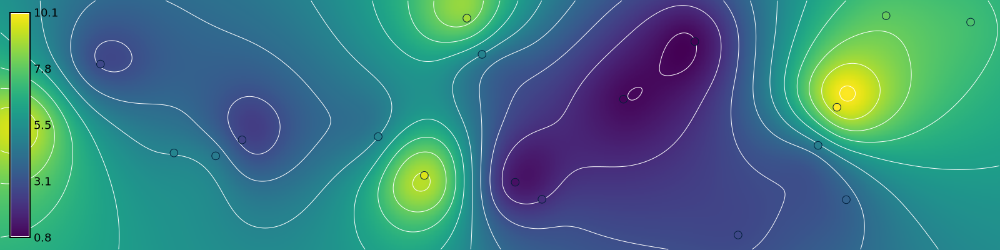
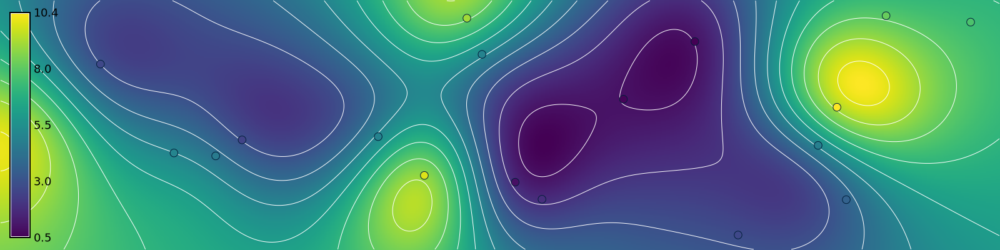
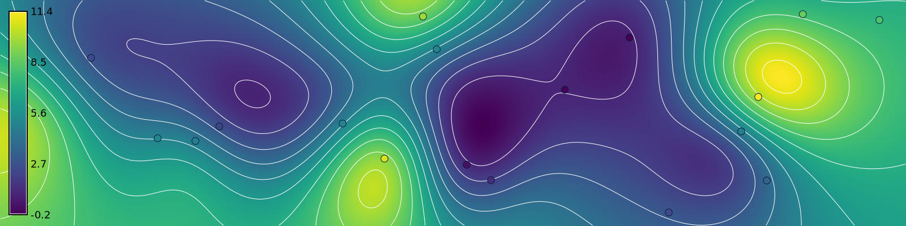

This is a gentle introduction to spatial interpolation using GRASS. It covers binning, Voronoi tessellations, Delaunay triangulation, inverse weighted distance interpolation, bilinear spline interpolation, bicubic spline interpolation, regularized spline with tension interpolation, and cross-validation for parameter optimization. In this tutorial we will generate a random population of points representing samples of a spatial phenomena and then interpolate them as a surface using different methods. 

::: {.callout-note title="Tutorials"}
Learn more with Paulo van Breugel's tutorial on [spatial interpolation](https://ecodiv.earth/TutorialsNotes/LegacyNotes/toc/spatial_interpolation.html).
:::

## Setup

Start GRASS in a Cartesian coordinate system. 

```{python}
# Import modules
import os
import sys
import subprocess
from pathlib import Path

# Find GRASS Python packages
sys.path.append(
  subprocess.check_output(
    ["grass", "--config", "python_path"],
    text=True
    ).strip()
  )

# Import GRASS packages
import grass.script as gs
import grass.jupyter as gj
from grass.tools import Tools

# Initialize GRASS session
gs.create_project("interpolation", overwrite=True)
gj.init("interpolation")
tools = Tools(overwrite=True)

# Print projection
projection = tools.g_proj(format="shell", flags="p").keyval
print(projection.get("name"))
```

## Set region

Set the computational region with 
.

```{python}
# Set region
tools.g_region(n=200, s=0, e=800, w=0, res=1)
```

## Generate random points

Generate a population of random 3-dimensional points 
for interpolation using . 

```{python}
# Generate random points
tools.v_random(
    output="points",
    npoints=20,
    zmin=0.0,
    zmax=10.0,
    column="z",
    seed=17,
    flags="z"
    )

# Visualize
m = gj.Map(width=800)
m.d_vect(map="points", icon="basic/point", zcolor="viridis", size=15)
m.show()
```



## Binning





```{python}
# Grid
tools.v_mkgrid(map="surface", box=[50, 50], flags="h")

# Sample points
tools.v_vect_stats(
    points="points",
    areas="surface",
    method="average",
    points_column="z",
    count_column="count",
    stats_column="z"
    )

# Set color gradient
tools.v_colors(map="surface", use="attr", column="z", color="viridis")

# Visualize
m = gj.Map(width=800)
m.d_vect(map="surface")
tools.v_colors(map="surface", flags="r")
m.d_vect(map="surface",  color="white", fill="none")
m.d_vect(map="points", icon="basic/point", color="white", fill="white", size=15)
m.show()
```



## Voronoi tessellation





```{python}
# Interpolate surface
tools.v_voronoi(input="points", output="surface")

# Sample points
tools.v_vect_stats(
    points="points",
    areas="surface",
    method="average",
    points_column="z",
    count_column="count",
    stats_column="z"
    )

# Set color gradient
tools.v_colors(map="surface", use="attr", column="z", color="viridis")

# Visualize
m = gj.Map(width=800)
m.d_vect(map="surface",  color="white")
tools.v_colors(map="surface", flags="r")
m.d_vect(map="surface",  color="white", fill="none")
m.d_vect(map="points", icon="basic/point", color="white", fill="white", size=15)
m.show()
```



## Delaunay triangulation







```{python}
# Sample corners
tools.v_in_region(output="region", type="line")
tools.v_to_points(input="region", output="corners", use="vertex")
tools.v_patch(input=["points", "corners"], output="samples")

# Interpolate surface
tools.v_delaunay(input="samples", output="surface")

# Set color gradient
tools.v_colors(map="surface", use="z", color="viridis")

# Visualize
m = gj.Map(width=800)
m.d_vect(map="surface")
m.d_vect(map="points", icon="basic/point", zcolor="viridis", size=15)
m.show()
```



## Inverse weighted distance interpolation





```{python}
# Interpolate surface
tools.v_surf_idw(input="points", output="surface", power=2.0)

# Set color gradient
tools.r_colors(map="surface", color="viridis")

# Compute contours
tools.r_contour(input="surface", output="contours", step=1)

# Visualize
m = gj.Map(width=800)
m.d_rast(map="surface")
m.d_vect(map="contours", color="white")
m.d_vect(map="points", icon="basic/point", zcolor="viridis", size=15)
m.d_legend(raster="surface", at=(5, 95, 1, 3))
m.show()
```



## Bilinear spline interpolation





```{python}
# Interpolate surface
tools.v_surf_bspline(
    input="points",
    raster_output="surface",
    method="bilinear",
    ew_step=25,
    ns_step=25
    )

# Set color gradient
tools.r_colors(map="surface", color="viridis")

# Compute contours
tools.r_contour(input="surface", output="contours", step=1)

# Visualize
m = gj.Map(width=800)
m.d_rast(map="surface")
m.d_vect(map="contours", color="white")
m.d_vect(map="points", icon="basic/point", zcolor="viridis", size=15)
m.d_legend(raster="surface", at=(5, 95, 1, 3))
m.show()
```



## Bicubic spline interpolation





```{python}
# Interpolate surface
tools.v_surf_bspline(
    input="points",
    raster_output="surface",
    method="bicubic",
    ew_step=25,
    ns_step=25
    )

# Set color gradient
tools.r_colors(map="surface", color="viridis")

# Compute contours
tools.r_contour(input="surface", output="contours", step=1)

# Visualize
m = gj.Map(width=800)
m.d_rast(map="surface")
m.d_vect(map="contours", color="white")
m.d_vect(map="points", icon="basic/point", zcolor="viridis", size=15)
m.d_legend(raster="surface", at=(5, 95, 1, 3))
m.show()
```



## Regularized spline with tension interpolation





```{python}
# Interpolate surface
tools.v_surf_rst(input="points", elevation="surface", tension=40, flags="t")

# Set color gradient
tools.r_colors(map="surface", color="viridis")

# Compute contours
tools.r_contour(input="surface", output="contours", step=1)

# Visualize
m = gj.Map(width=800)
m.d_rast(map="surface")
m.d_vect(map="contours", color="white")
m.d_vect(map="points", icon="basic/point", zcolor="viridis", size=15)
m.d_legend(raster="surface", at=(5, 95, 1, 3))
m.show()
```



## Parameter Optimization






```{python}
# Install addon
tools.g_extension(extension="v.surf.rst.cv")
```

```{python}
# Optimize parameters
parameters = tools.v_surf_rst_cv(
    point_cloud="points",
    format="json",
    output_file="parameters.json",
    flags="t"
    )
results = parameters["results"]
mae = min(results, key=lambda x: x["rmse"])["mae"]
rmse = min(results, key=lambda x: x["rmse"])["rmse"]
nmad = min(results, key=lambda x: x["rmse"])["nmad"]
tension = min(results, key=lambda x: x["rmse"])["tension"]
smooth = min(results, key=lambda x: x["rmse"])["smooth"]
print(f"Root mean squared error: {rmse}")
print(f"Mean absolute error: {mae}")
print(f"Normalized median absolute deviation: {nmad}")
print(f"Tension: {tension}")
print(f"Smoothing: {smooth}")
```


```{python}
# Interpolate surface
tools.v_surf_rst(
    input="points",
    elevation="surface",
    tension=tension,
    smooth=smooth,
    flags="t"
    )

# Set color gradient
tools.r_colors(map="surface", color="viridis")

# Compute contours
tools.r_contour(input="surface", output="contours", step=1)

# Visualize
m = gj.Map(width=800)
m.d_rast(map="surface")
m.d_vect(map="contours", color="white")
m.d_vect(map="points", icon="basic/point", zcolor="viridis", size=15)
m.d_legend(raster="surface", at=(5, 95, 1, 3))
m.show()
```


